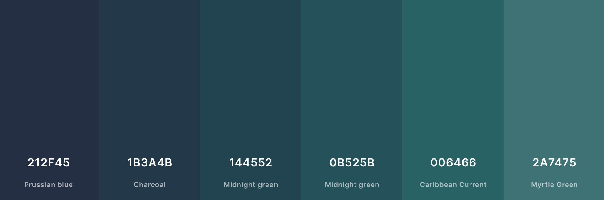

You've probably seen these awesome customised prompts in YouTube videos or coding tutorials online and wondered how to do this. I have! I finally had some time to look into them and it's actually not hard to configure one for your own terminal. Below are the instructions that worked for me using MacOS Sonoma with the [iTerm 2](https://iterm2.com) terminal app. 

## Prerequisites

[Homebrew](https://brew.sh) makes it very easy to install all the required dependencies. 

## 1. Install a Nerd Font

First you need a special font that can render the symbols often used for these prompts. Pick a Nerd Font from [here](https://www.nerdfonts.com/font-downloads) and install it with `brew`. I picked [*Hack Nerd Font*](https://www.programmingfonts.org/#hack) but there are many alternatives. 

```bash
brew install --cask font-hack-nerd-font
```

You can confirm in the *Font Book* MacOS Application that the font is installed on your system. You'll need to set that font in *iTerm 2* under Profiles → Text. 

## 2. Install Starship

[Starship](https://starship.rs) is a Rust-clone of the popular [Spaceship](https://spaceship-prompt.sh) prompt framework. It's very fast and easy to configure, with many different plugins and presets already built in. 

Again we can use `brew` to install Starship:

```bash
brew install starship
```

Then you need to add one line at the top of your shell config file to load Starship. I'm using `zsh` as my shell, which is the default since MacOS Catalina. If you're using `bash` or another shell, see [here](https://starship.rs/#quick-install) for instructions. 

```bash
# initialise starship
eval "$(starship init zsh)"

# ... rest of file ...
```


## 3. Configuration and Styling

Starship is highly [configurable](https://starship.rs/config/). If you want something really bespoke and have too much time on your hands, by all means, knock yourself out. I went with one of the [presets](https://starship.rs/presets/) and just made some tweaks. 

I chose the [Gruvbox Rainbow Preset](https://starship.rs/presets/gruvbox-rainbow) as my starting point, which looks like this:

I found the colour contrasts a bit hard to read and wanted something a little more monochromatic. 

I also changed the Python section of the prompt a little to only show the `major.minor` version of my Python interpreter, which is what I mostly care about. Finally I included the virtual environment in the Python section, since I use [`venv`](https://docs.python.org/3/library/venv.html) with all my projects. 

The configuration for the prompt is stored under `~/.config/starship.toml`, you'll need to make some edits to that file. It's pretty self-explanatory, but I'll post my full config below for reference.

As for the colours, I find [coolers.co](https://coolors.co/palettes/popular/6%20colors) is a pretty neat tool to explore different palettes and see what works well together. I filtered for 6 colours and browsed for something I liked. In the palette viewer, you can make additional changes to individual colours, and this is what I finally ended up with: 


 
And that's pretty much it, awesome prompt in 3 steps. 


## Starship Config

Save the below snippet as `startship.toml`.

```text
"$schema" = 'https://starship.rs/config-schema.json'

format = """
[](color_line_1)\
$os\
$username\
[](bg:color_line_2 fg:color_line_1)\
$directory\
[](fg:color_line_2 bg:color_line_3)\
$git_branch\
$git_status\
[](fg:color_line_3 bg:color_line_4)\
$c\
$rust\
$golang\
$nodejs\
$php\
$java\
$kotlin\
$haskell\
$python\
[](fg:color_line_4 bg:color_line_5)\
$docker_context\
$conda\
[](fg:color_line_5 bg:color_line_6)\
$time\
[ ](fg:color_line_6)\
$line_break$character"""

palette = 'teal_gradient'

[palettes.teal_gradient]
color_fg0 = '#ffffff'
color_fg1 = '#000000'
color_line_1 = '#212F45'
color_line_2 = '#1B3A4B'
color_line_3 = '#144552'
color_line_4 = '#0B525B'
color_line_5 = '#006466'
color_line_6 = '#2A7475'
color_green = '#98971a'
color_red = '#cc241d'
color_purple = '#b16286'

[os]
disabled = false
style = "bg:color_line_1 fg:color_fg0"

[os.symbols]
Windows = "󰍲"
Ubuntu = "󰕈"
SUSE = ""
Raspbian = "󰐿"
Mint = "󰣭"
Macos = "󰀵"
Manjaro = ""
Linux = "󰌽"
Gentoo = "󰣨"
Fedora = "󰣛"
Alpine = ""
Amazon = ""
Android = ""
Arch = "󰣇"
Artix = "󰣇"
CentOS = ""
Debian = "󰣚"
Redhat = "󱄛"
RedHatEnterprise = "󱄛"

[username]
show_always = true
style_user = "bg:color_line_1 fg:color_fg0"
style_root = "bg:color_line_1 fg:color_fg0"
format = '[ $user ]($style)'

[directory]
style = "fg:color_fg0 bg:color_line_2"
format = "[ $path ]($style)"
truncation_length = 3
truncation_symbol = "…/"

[directory.substitutions]
"Documents" = "󰈙 "
"Downloads" = " "
"Music" = "󰝚 "
"Pictures" = " "
"Developer" = "󰲋 "

[git_branch]
symbol = ""
style = "bg:color_line_3"
format = '[[ $symbol $branch ](fg:color_fg0 bg:color_line_3)]($style)'

[git_status]
style = "bg:color_line_3"
format = '[[($all_status$ahead_behind )](fg:color_fg0 bg:color_line_3)]($style)'

[nodejs]
symbol = ""
style = "bg:color_line_4"
format = '[[ $symbol( $version) ](fg:color_fg0 bg:color_line_4)]($style)'

[c]
symbol = " "
style = "bg:color_line_4"
format = '[[ $symbol( $version) ](fg:color_fg0 bg:color_line_4)]($style)'

[rust]
symbol = ""
style = "bg:color_line_4"
format = '[[ $symbol( $version) ](fg:color_fg0 bg:color_line_4)]($style)'

[golang]
symbol = ""
style = "bg:color_line_4"
format = '[[ $symbol( $version) ](fg:color_fg0 bg:color_line_4)]($style)'

[php]
symbol = ""
style = "bg:color_line_4"
format = '[[ $symbol( $version) ](fg:color_fg0 bg:color_line_4)]($style)'

[java]
symbol = " "
style = "bg:color_line_4"
format = '[[ $symbol( $version) ](fg:color_fg0 bg:color_line_4)]($style)'

[kotlin]
symbol = ""
style = "bg:color_line_4"
format = '[[ $symbol( $version) ](fg:color_fg0 bg:color_line_4)]($style)'

[haskell]
symbol = ""
style = "bg:color_line_4"
format = '[[ $symbol( $version) ](fg:color_fg0 bg:color_line_4)]($style)'

[python]
symbol = ""
style = "bg:color_line_4"
version_format = "v${major}.${minor}"
format = '[[ $symbol( $version)( \($virtualenv\)) ](fg:color_fg0 bg:color_line_4)]($style)'

[docker_context]
symbol = ""
style = "bg:color_line_5"
format = '[[ $symbol( $context) ](fg:#83a598 bg:color_line_5)]($style)'

[conda]
style = "bg:color_line_5"
format = '[[ $symbol( $environment) ](fg:#83a598 bg:color_line_5)]($style)'

[time]
disabled = false
time_format = "%R"
style = "bg:color_line_6"
format = '[[  $time ](fg:color_fg0 bg:color_line_6)]($style)'

[line_break]
disabled = false

[character]
disabled = false
success_symbol = '[](bold fg:color_green)'
error_symbol = '[](bold fg:color_red)'
vimcmd_symbol = '[](bold fg:color_green)'
vimcmd_replace_one_symbol = '[](bold fg:color_purple)'
vimcmd_replace_symbol = '[](bold fg:color_purple)'
vimcmd_visual_symbol = '[](bold fg:color_line_2)'
```

Note that some of the special characters don't render on this page, but they will if you use one of the Nerd fonts. 
